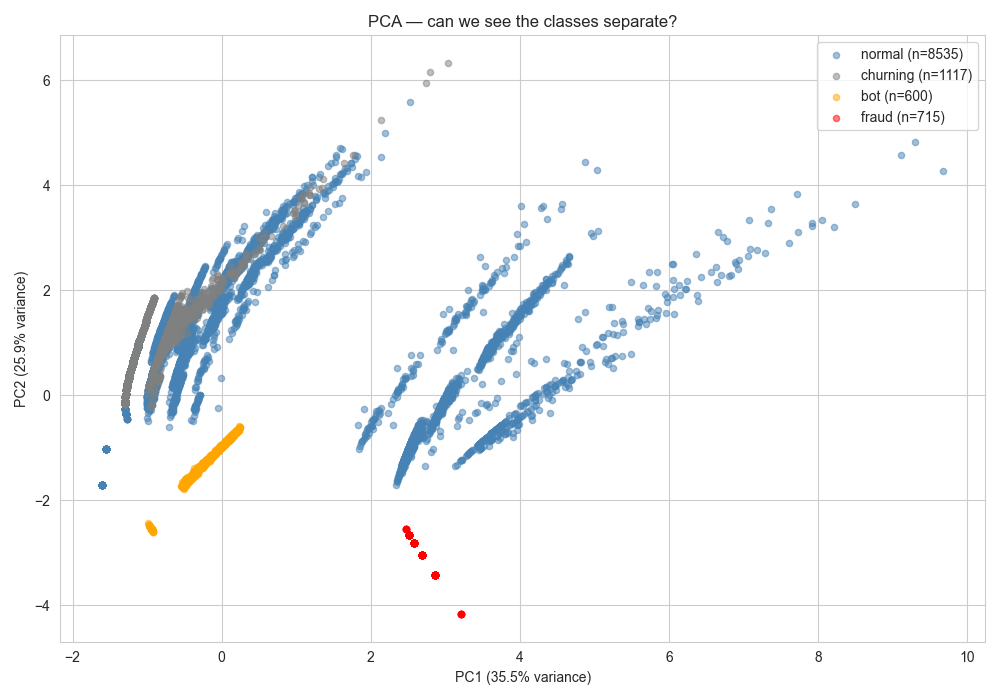

## Goal
To detect anomaly from user sessions.

# Phase 0
## Dataset
- Simulator generates 4 agent types: normal, churning, bots, fraud rings
- 11,000 sessions, about 12% true anomaly rate
- 9 features per session:
    - events per minute
    - session duration (in seconds)
    - has payment 
    - cart_to_purchase_ratio
    - avg_time_between_events
    - signup_to_purchase_speed
    - page_revisit_ratio
    - unique_pages_visited
    - event_type_diversity
## Method
- Train/ test split: 70/30 stratified on true label
- Pseudolabeling approach: use many unsupervised models to generate labels, then use XGBoost to train on those labels, evaluation is against true labels held out from training.
- Why pseudo labeling: in reality, ground truth labels are rare, so i wanted to keep that in mind.

## Results
|        Labeler       | Labeler F1 vs truth | XGBoost F1 (test) | Bot recall | Fraud recall |   |
|:--------------------:|:-------------------:|:-----------------:|:----------:|:------------:|---|
| Isolation Forest     | 0.40                | 0.49              | 100%       | 27%          |   |
| Autoencoder          | ~0.97               | 0.88              | 100%       | 100%         |   |
| Heuristic (rules)    | 1.00                | 1.00              | 100%       | 100%         |   |
| Ensemble (2-of-3)    | ~0.95               | 0.93              | 100%       | 100%         |   |
| Oracle (true labels) | 1.00                | 1.00              | 100%       | 100%         |   |

## Notes
### Isolation Forest
This one catches volume-based anomalies (bots) easily but struggles with dense small clusters. Fraud sessions form a tight cluster which iso forest sees them as normal because they have many similiar points. Confirmed via PCA visualization: fraud cluster is clearly separated, IF still misses it. 
Use case: quick baseline, exploratory anomaly detection, not for production alone.

### Autoencoder
Trained only on normal sessions, so that anomalies fail to reconstruct. Mean reconstruction error: normal=0.13, bot=33, fraud=57 — extreme separation. 
**Why it beats IF on fraud**: measures distance from normal-manifold rather than density, so dense anomaly clusters are still flagged. 
**Use case**: robust unsupervised baseline, good for novel anomaly types.

## Heuristic Rules
Two rules: events_per_minute > 30 (catches bots) and session_duration < 10s AND has_payment (catches fraud). Tied oracle at F1=1.0. 
**Important caveat**: this matches oracle because the simulator's agents are deterministic. In production, fraudsters adapt — a bot that throttles below 30 epm or a fraudster who browses before checkout would defeat these rules trivially. Heuristics are useful as components of an ensemble, not as standalone detectors. They also serve as a stand-in for SME-defined rules in real fraud teams.

## Ensemble (2-of-3)
Majority vote across IF, autoencoder, and heuristic. F1=0.93. Lower than autoencoder alone because IF's noisy votes (40% F1) sometimes outvote correct autoencoder/heuristic predictions on edge cases. 
**Lesson**: ensembles don't always improve performance — adding a weak labeler can hurt. Worth keeping as the production approach because it's more robust to any single labeler failing.

## Decision: Register Autoencoder as Production Model
Despite the heuristic tying oracle on this dataset, I'm registering autoencoder as the v1 production model because:

**Robustness**: autoencoder learned a representation of normal behavior. Heuristic depends on two specific feature thresholds. A small distribution shift breaks the heuristic; autoencoder degrades more gracefully.
**Adaptability**: when traffic patterns evolve, retraining the autoencoder is automatic. Updating heuristics requires human judgment.
**Generalization**: in phase 1 (stealth agents) the heuristic is expected to fail hard while autoencoder should retain partial recall.

The heuristic remains in the ensemble as a complementary signal.

## Limitations 
Simulator agents are deterministic. All bots have events_per_minute between 50-120. All fraud rings have 4-second checkout sessions. Real fraud has within-class variance my data doesn't capture. Phase 1 introduces evasive agents to address this.
**No cross-session features**. Fraud rings share IP subnets and target the same product across "different" users. None of my 9 per-session features capture this. IF's 27% fraud recall reflects this gap. Phase 3 plan: add subnet_session_count, product_concentration features.
**Heuristics derived from EDA on the same dataset**. Mild form of label leakage — I picked thresholds after seeing the data. In production, heuristics come from SMEs before model training.
**Class imbalance not extreme enough**. Real fraud is 0.1-2% of traffic; my simulator runs at 12%. Models would face harder precision/recall tradeoffs at production rates.

## What I'd Do Differently With More Time

Survival analysis for churn prediction as a separate secondary model (week 4 stretch goal)
Cross-session features for fraud ring detection
Time-windowed evaluation to test concept drift handling
Analyst feedback loop simulation — replay a delayed-label scenario where labels arrive 7 days after the prediction

Threshold Selection
Autoencoder threshold set at 95th percentile of validation reconstruction errors. Tradeoff:

95% → ~5% false positive rate on legitimate users, near-100% recall on simulated anomalies
99% → fewer FPs but misses subtle anomalies
90% → catches everything but ~10% FP rate (analyst review burden)

For the demo I chose 95%; in production this should be tuned against business cost-per-FP and cost-per-FN.
Reproducibility
bashdocker compose up -d              # MLflow, Redis, Redpanda, Spark
python -m simulator.run --scenario mixed_large
# wait for Spark to drain
python -m models.run_pipeline
All runs logged to MLflow at http://localhost:5000, experiment anomaly_detection_pipeline.